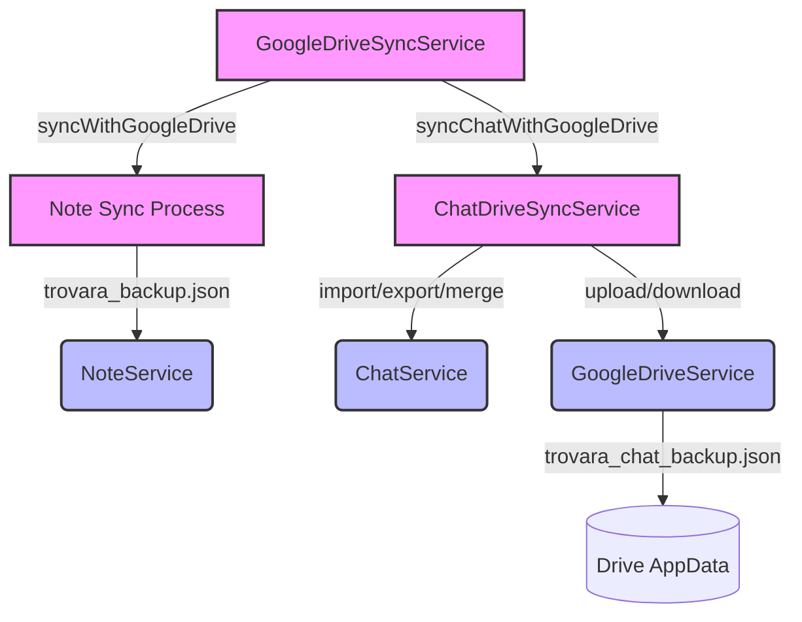

# Chat Drive Sync Service

> Synchronizes chat history (threads and messages) with Google Drive AppData.

`ChatDriveSyncService` follows the same pull-merge-push pattern as
`GoogleDriveSyncService` (for notes) but operates on `ChatService` data
and a separate Drive file (`trovara_chat_backup.json`).

---

## Table of Contents

1. [Overview](#1-overview)
2. [Architecture](#2-architecture)
3. [Sync Flow](#3-sync-flow)
4. [Public API](#4-public-api)
5. [Error Handling](#5-error-handling)
6. [Dependency Injection](#6-dependency-injection)

---

## 1. Overview

Chat history is synced independently from notes so that the two data sets
can evolve separately. The chat sync is triggered as a secondary step
during the main note sync (`GoogleDriveSyncService.syncWithGoogleDrive`
calls it in a non-blocking try/catch).

**Backup file:** `trovara_chat_backup.json` (in Drive AppData)

---

## 2. Architecture



---

## 3. Sync Flow

`syncChatWithGoogleDrive()` performs a four-step process:

| Step | Action                                            | Timeout |
| ---- | ------------------------------------------------- | ------- |
| 1    | Download `trovara_chat_backup.json` from Drive    | 30s     |
| 2    | Merge local + remote (latest `updatedAt` wins)    | —       |
| 3    | Apply merged data locally via `importAllFromJson` | 30s     |
| 4    | Upload merged data back to Drive                  | 30s     |

If no remote data exists (first sync), local data is simply uploaded.

---

## 4. Public API

### `syncChatWithGoogleDrive()`

```dart
Future<ChatSyncResult> syncChatWithGoogleDrive()
```

Full sync cycle. Assumes the user is already signed in.

### `syncWithAuthentication()`

```dart
Future<ChatSyncResult> syncWithAuthentication()
```

Signs in (if needed) then runs `syncChatWithGoogleDrive()`.

### `syncWithLoadingOverlay(context)`

```dart
Future<ChatSyncResult> syncWithLoadingOverlay(BuildContext context)
```

Wraps `syncWithAuthentication()` in a loading overlay via
`NmLoadingOverlay.showSync`.

### `showSyncResultToast(context, result)`

Displays a success or error toast based on the `ChatSyncResult`.

### `ChatSyncResult`

```dart
class ChatSyncResult {
  final bool isSuccess;
  final String message;
}
```

---

## 5. Error Handling

Errors are mapped to user-friendly messages:

| Error pattern        | Message                                                    |
| -------------------- | ---------------------------------------------------------- |
| `401`, `auth`        | Authentication failed. Please try signing in again.        |
| `403`, `permission`  | Access denied. Please check your Google Drive permissions. |
| `network`, `timeout` | Network error. Please check your internet connection.      |
| `cancelled`          | Chat sync was cancelled.                                   |
| `quota`, `storage`   | Google Drive storage quota exceeded.                       |
| Other                | Chat sync failed: `<truncated message>`                    |

---

## 6. Dependency Injection

```dart
ChatDriveSyncService get chatDriveSyncService {
  _chatDriveSyncService ??= ChatDriveSyncService();
  return _chatDriveSyncService!;
}
```

Uses `ServiceLocator().googleDriveService` and `ServiceLocator().chatService`
internally. Access via `ServiceLocator().chatDriveSyncService`.
