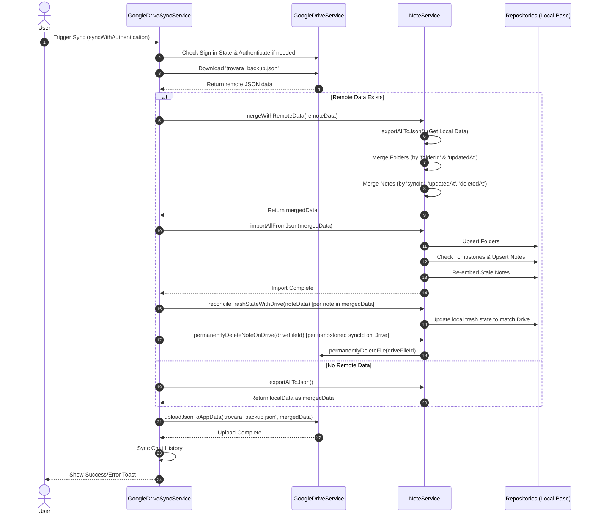

# Note Synchronization Flow

The following diagram illustrates how notes and folders are synchronized between the local device and Google Drive in Trovara.

### Key Merge Resolution Rules (Git-like strategy)

1. **Identities**: Folders are matched by `folderId`. Notes are matched by `syncId`.
2. **Missing Items**: If an item exists only locally or only remotely, it is kept in the merged set.
3. **Conflict Resolution**:
   - If both exist, their `updatedAt` timestamps are compared. The newest change wins.
   - For Notes, `deletedAt` (trash state) is also checked. If the trash state differs, the most recent action (deletion vs update) determines the winner.
4. **Tombstones**: Permanently deleted notes are tracked by `deletedSyncIds` to ensure they aren't accidentally restored from an older backup on another device.
